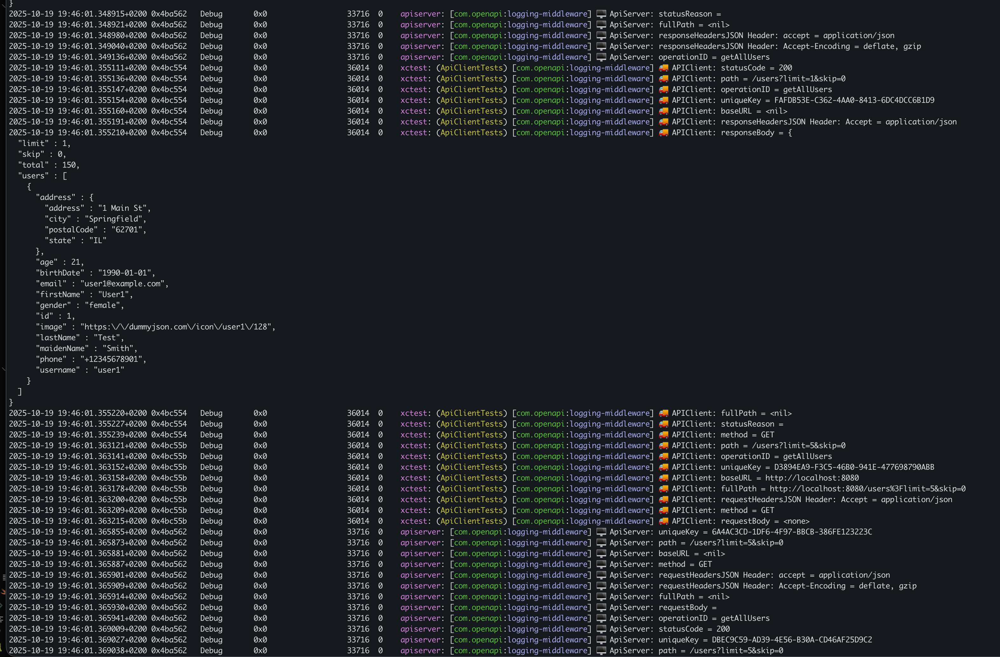

# swift-openapi-extremepackaging-example

A reference implementation of OpenAPI Generator for Swift, built using the Extreme Packaging architecture.  This repository demonstrates how to structure a Swift project that consumes generated OpenAPI clients and models while keeping the codebase modular, testable, and scalable across platforms (iOS, macOS, and server-side Swift).

## Project Evolution

This project started as a fork of [ExtremePackaging](https://github.com/mihaelamj/ExtremePackaging) and has been extended with a complete OpenAPI implementation.

### What Was Added

#### 1. OpenAPI Schema & Code Generation
- **OpenAPI Specification** (`openapi.yaml`) defining a DummyJSON-compatible API with:
  - Authentication endpoints (login with JWT tokens)
  - CRUD operations for Users, Posts, Products, Todos, Comments, and Carts
  - Comprehensive schema definitions with proper types
  - Pagination support for list endpoints
  - Error response schemas (404, validation errors)
- **Custom Implementation Note**: This example was built from scratch using [DummyJSON](https://dummyjson.com) as inspiration. All endpoints were added manually by the repository author, but the architecture supports adding any endpoints—feel free to extend with your own API definitions.
- **Swift OpenAPI Generator** integration for automatic code generation
- Generated types, client, and server code from the OpenAPI spec

#### 2. API Server Implementation
- **Local Mock Server** (`ApiServer`) built with Vapor:
  - Implements all 17 API endpoints from the OpenAPI spec
  - Returns realistic mock data compatible with DummyJSON API
  - Server-side logging middleware with 🖥️ prefix
  - Proper error handling (404s, validation errors)
  - Pagination support matching the spec
  - Runs on `http://localhost:8080`

#### 3. Enhanced API Client Architecture
- **Actor-based ApiClient** with middleware support:
  - Thread-safe access to HTTP client
  - Environment switching (production/local)
  - Middleware chain: Logging → Authentication
  - Shared instance pattern for convenience

- **Authentication Middleware**:
  - Bearer token authentication via `BearerTokenAuthMiddleware`
  - Token management with `ApiClientState` actor
  - Automatic `Authorization` header injection
  - Public operation configuration support

- **Logging Middleware**:
  - Request/response logging with 🚚 prefix for client-side
  - JSON log persistence to `~/Documents/_DummyJSON_APIClient.json`
  - Console output via Swift Logging framework
  - Full request/response body logging
  - Unique request IDs for tracing



##### Real-Time Log Streaming

**Method 1: Terminal (Recommended for Development)**

Open Terminal and run:
```bash
# Stream ALL logs from the middleware in real-time
log stream --predicate 'subsystem == "com.openapi"' --level debug
```

#### 4. Convenience API Layer
- **User-friendly extension methods** (`ApiClient+Convenience.swift`):
  - Clean wrapper types: `UserListResponse`, `PostListResponse`, etc.
  - Simplified method signatures with named parameters
  - Direct schema object returns (no complex OpenAPI types)
  - Automatic response unwrapping and error handling
  - Default pagination values

Example:
```swift
// Instead of complex OpenAPI types:
let response: Operations.GetAllUsers.Output.Ok.Body.jsonPayload

// You get clean wrapper types:
let response: UserListResponse // Contains users array + metadata
```

#### 5. Comprehensive Test Suite
- **Local Tests** (`ApiClientLocalTests.swift`):
  - 25 tests for local server endpoints
  - Server availability check (auto-skip if not running)
  - Tests all convenience methods
  - Pagination validation
  - Error handling (404s)
  - Integration workflows

- **Production Tests** (`ApiClientProductionTests.swift`):
  - 29 tests against real DummyJSON API
  - Authentication flow tests with token management
  - Concurrent request handling
  - Environment switching validation
  - Pagination boundaries
  - Full integration workflows
  - Error handling for invalid IDs

#### 6. Middleware Integration
- **OpenAPILoggingMiddleware** (v1.0.0+):
  - Dual output: console + JSON file
  - Structured logging with metadata
  - Request/response body capture
  - HTTP headers logging

- **BearerTokenAuthMiddleware** (v1.1.0):
  - JWT token support
  - Automatic header injection
  - Operation-level public/private configuration

### YamlMerger Tool

This project uses [YamlMerger](https://github.com/mihaelamj/YamlMerger) for managing OpenAPI schema files. YamlMerger is a critical tool in the development workflow that enables modular schema management.

#### Why YamlMerger is Important

- **Modular Schema Management**: Instead of maintaining one massive `openapi.yaml` file, you can split your API specification into multiple logical files (e.g., `schemas/User.yaml`, `schemas/Post.yaml`, `paths/users.yaml`)
- **Better Organization**: Each resource type, endpoint group, or component can be maintained in separate files
- **Team Collaboration**: Multiple developers can work on different parts of the API spec without merge conflicts
- **Reusability**: Common schemas and components can be extracted and reused across multiple API specifications

#### Why It Must Be Copied to Project Structure

YamlMerger **cannot** be used directly as a Swift Package Manager dependency for the build process because:

1. **SPM Package Resolution Restrictions**: Swift Package Manager resolves dependencies into read-only cached locations (typically `~/Library/Caches/org.swift.swiftpm/` or `.build/checkouts/`)
2. **No Write Access**: The OpenAPI generation process needs to write the merged `openapi.yaml` file to a specific location in your source tree
3. **Build Script Limitations**: SPM build scripts cannot write files outside the package's build directory into the source tree

**Solution**: Copy the YamlMerger executable directly into your project repository (e.g., `Tools/YamlMerger`) so it can be executed during the build process with proper write permissions to your `Sources/` directory.

#### How YamlMerger is Used

The typical workflow with YamlMerger:

```bash
# 1. Organize your API spec into separate files
Sources/SharedApiModels/schemas/
├── base.yaml              # Base OpenAPI info and servers
├── schemas/
│   ├── User.yaml
│   ├── Post.yaml
│   ├── Product.yaml
│   └── AuthResponse.yaml
└── paths/
    ├── users.yaml
    ├── posts.yaml
    └── auth.yaml

# 2. Run YamlMerger to combine all files
./Tools/YamlMerger merge \
  --input Sources/SharedApiModels/schemas/ \
  --output Sources/SharedApiModels/openapi.yaml

# 3. Swift OpenAPI Generator reads the merged file
# (configured in openapi-generator-config.yaml)
swift build  # Triggers OpenAPI code generation
```

#### Integration with Build Process

You can integrate YamlMerger into your build pipeline:

1. **Pre-build Script**: Add a build phase that runs YamlMerger before compilation
2. **Manual Workflow**: Run YamlMerger manually when schema files change
3. **Git Hooks**: Use pre-commit hooks to automatically merge schemas before commits
4. **CI/CD**: Run YamlMerger in your continuous integration pipeline

**Example pre-build script**:
```bash
#!/bin/bash
# Scripts/merge-openapi-schemas.sh

echo "Merging OpenAPI schemas..."
./Tools/YamlMerger merge \
  --input Sources/SharedApiModels/schemas/ \
  --output Sources/SharedApiModels/openapi.yaml

if [ $? -eq 0 ]; then
  echo "✅ OpenAPI schemas merged successfully"
else
  echo "❌ Failed to merge OpenAPI schemas"
  exit 1
fi
```

**Note**: In this reference project, we use a single `openapi.yaml` file for simplicity. However, for larger APIs with dozens of endpoints and schemas, YamlMerger becomes essential for maintaining the codebase.

### Project Structure
```
Packages/
├── Sources/
│   ├── ApiClient/           # Client with middlewares
│   │   ├── ApiClient.swift  # Actor-based client
│   │   ├── ApiClient+Convenience.swift  # User-friendly API
│   │   └── ApiClient_*.swift  # 17 endpoint implementations
│   ├── ApiServer/           # Vapor-based mock server
│   │   ├── main.swift       # Server setup
│   │   └── ApiServer_*.swift  # 17 endpoint handlers
│   └── SharedApiModels/     # Generated OpenAPI code
│       ├── openapi.yaml     # API specification
│       └── openapi-generator-config.yaml
└── Tests/
    └── ApiClientTests/
        ├── ApiClientLocalTests.swift      # 25 local tests
        └── ApiClientProductionTests.swift # 29 production tests
```

### Running the Project

#### Start Local Server
```bash
cd Packages
swift run apiserver
# Server starts at http://localhost:8080
```

#### Run Tests
```bash
# Local tests (requires server running)
swift test --filter ApiClientLocalTests

# Production tests (hits DummyJSON API)
swift test --filter ApiClientProductionTests

# All API tests
swift test --filter ApiClient
```

#### Using the Client
```swift
// Initialize
try await ApiClient.initializeShared(environment: .production)
let client = ApiClient.shared!

// Login and get token
let auth = try await client.login(username: "emilys", password: "emilyspass")
await ApiClient.setToken(auth.accessToken)

// Make authenticated requests
let users = try await client.getUsers(limit: 10)
let posts = try await client.getPosts(limit: 5)
let products = try await client.getProducts()
```

### Key Features
- ✅ Complete OpenAPI workflow (spec → generation → implementation)
- ✅ Type-safe API client with generated code
- ✅ Mock server for local development
- ✅ Production-ready with real API integration
- ✅ Comprehensive middleware support
- ✅ Full authentication flow (JWT tokens)
- ✅ Structured logging (console + JSON file)
- ✅ Extensive test coverage (54 tests)
- ✅ Clean, user-friendly API layer
- ✅ Thread-safe actor-based architecture

### Dependencies
- [Swift OpenAPI Generator](https://github.com/apple/swift-openapi-generator) (1.0.0+)
- [Swift OpenAPI Runtime](https://github.com/apple/swift-openapi-runtime) (1.0.0+)
- [Swift OpenAPI Vapor](https://github.com/swift-server/swift-openapi-vapor) (1.0.0+)
- [Vapor](https://github.com/vapor/vapor) (4.89.0+)
- [OpenAPILoggingMiddleware](https://github.com/mihaelamj/OpenAPILoggingMiddleware) (1.0.0+)
- [BearerTokenAuthMiddleware](https://github.com/mihaelamj/BearerTokenAuthMiddleware) (1.1.0)

### References
- Original Architecture: [ExtremePackaging](https://github.com/mihaelamj/ExtremePackaging)
- API Data: [DummyJSON](https://dummyjson.com)
